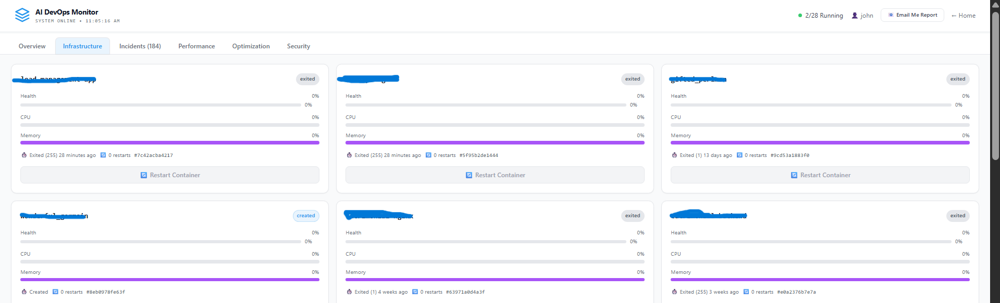
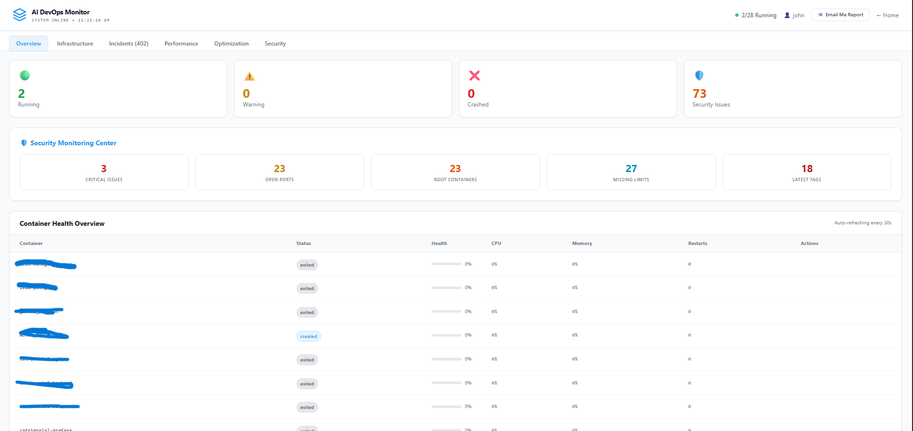
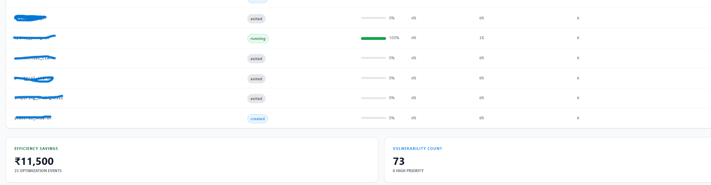
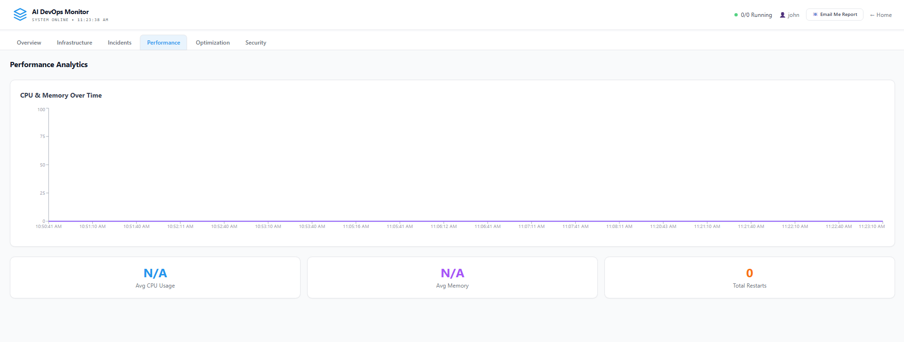

# 🖥️ AI DevOps Monitor — Live Demo Screenshots

> These screenshots are captured from a **real running instance** monitoring actual Docker containers on a local machine. Container names have been blurred for privacy.

---

## 📊 Dashboard Overview



The main dashboard provides a bird's-eye view of your entire Docker infrastructure:

- **Status Cards** — Running (2), Warning (0), Crashed (0), Security Issues (73)
- **Security Monitoring Center** — Real-time counts of Critical Issues (3), Open Ports (23), Root Containers (23), Missing Limits (27), Latest Tags (18)
- **Container Health Table** — Live view of all 28 containers with status badges, health bars, CPU/Memory usage, and restart counts
- **Efficiency Savings** — ₹11,500 saved today across 23 optimization events
- **Vulnerability Count** — 73 detected issues, 0 high priority

All data is fetched live from Docker — no fake numbers, no hardcoded values.

---

## 🏗️ Infrastructure View



Detailed card view of each container showing:
- Health, CPU, and Memory progress bars
- Container uptime and restart history
- Container ID for quick reference
- **Restart Container** button (Admin only)

Each card reflects real Docker `inspect` and `stats` data.

---

## 💰 Cost Optimization



AI-powered cost analysis that scans your containers and identifies waste:
- **₹11,500 Saved Today** — calculated from 23 idle/exited containers
- Each exited container that hasn apex been removed is flagged as a ₹500/day waste
- Actionable recommendations per container

These savings are computed from real container states, not estimates.

---

## 📈 Performance Analytics



Real-time performance tracking:
- **CPU & Memory Over Time** — Live chart updated every 30 seconds
- **Avg CPU Usage** — Aggregated across all running containers
- **Avg Memory** — Current memory pressure
- **Total Restarts** — System-wide restart count

The chart builds up over time as the monitoring cron collects data points.

---

## 🔐 How It Works

```
┌─────────────┐     ┌──────────────┐     ┌─────────────┐
│  Frontend   │────▶│   Backend    │────▶│   Docker    │
│  React UI   │◀────│  Node.js API │◀────│   Engine    │
│  :3000      │     │  :5003       │     │  (local)    │
└─────────────┘     └──────────────┘     └─────────────┘
                           │
                           ▼
                    ┌──────────────┐
                    │  AI Server   │
                    │  Python/ML   │
                    │  :5001       │
                    └──────────────┘
```

1. Backend connects to Docker via local socket
2. Cron job polls container stats every 30 seconds
3. Security scanner inspects each container for misconfigurations
4. AI model predicts crash probability from metrics
5. Frontend renders everything in a clean, real-time dashboard

---

## 🛡️ Security Features Detected

The scanner checks **real container configurations** for:
- ❌ Running as root user
- ❌ Privileged mode enabled
- ❌ Host network mode
- ❌ Docker socket mounted inside container
- ❌ Database ports (5432, 3306, 27017) exposed publicly
- ❌ Using `:latest` image tag
- ❌ No CPU/Memory resource limits set

---

## 🚀 Try It Yourself

```bash
git clone https://github.com/TenHoursVenturesTeam/AI-DevOps-Monitor.git
cd AI-DevOps-Monitor

# Start backend
cd backend && npm install && cp .env.example .env && npm start

# Start frontend (new terminal)
cd frontend && npm install && npm start
```

**Requirements:** Node.js 18+, Docker Desktop running

---

*Built with React, Node.js, Python, and scikit-learn*
